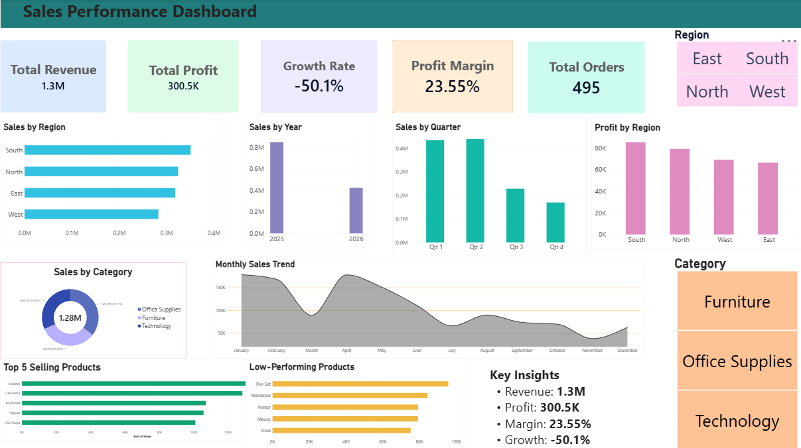

 Syntecxhub Sales Performance Dashboard

Project Overview
A Sales Performance Dashboard created using Power BI to analyze sales, profit, growth, products, regions, and categories.

Tools Used
- Power BI
- Power Query
- DAX
- Excel

 Key Features
- Total Revenue and Total Profit KPIs
- Profit Margin and Growth Rate
- Sales by Region and Category
- Monthly, Quarterly and Yearly Sales Trends
- Top 5 Selling Products
- Low-Performing Products
- Interactive Region and Category filters

Data Cleaning
- Removed duplicate records
- Handled missing values
- Corrected data types
- Prepared data for analysis using Power Query

Dashboard Preview

Project Files
- Power BI Dashboard (.pbix)
- Raw Sales Dataset (.xlsx)
- Dashboard Screenshot (.png)
